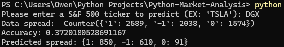
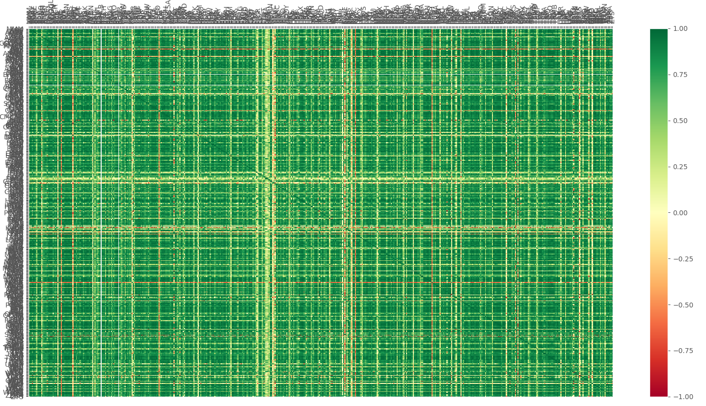
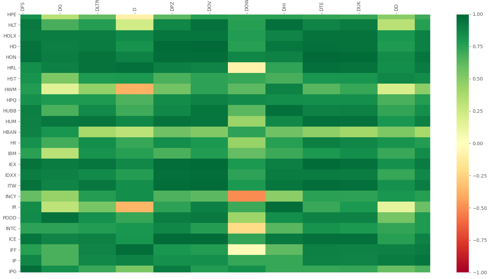
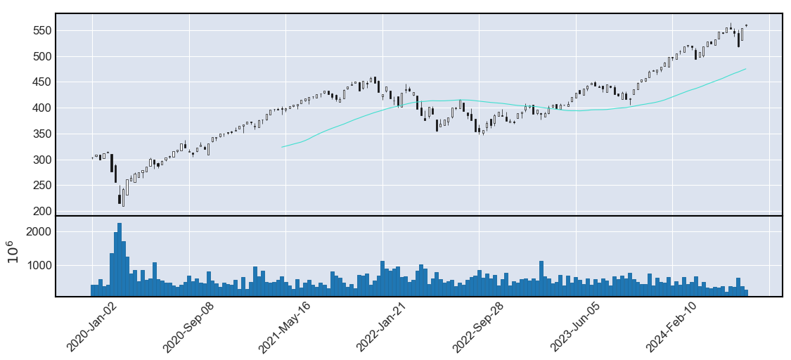

# Stock Market Prediction Models & Analysis With Python
This repository provides financial tools with Python:
- A machine learning Buy/Sell/Hold prediction model
- Correlation table generator of each stock in the S&P 500.
- S&P 500 stock data compilation tools for price analysis
- A stock charting program for displaying candlesticks

## Buy/Sell/Hold Prediction Model
**'buy sell hold prediction model.py'**\
A machine learning model trained on the daily price of each individual stock in the S&P 500 since 1/1/2000.

Unlike traditional models analyzing a single stock in isolation, this model leverages data from each stock in the S&P 500 and considers the relative performance of a stock compared to its peers.

**How It Works:** \
Data is pre-processed to label each time a stock increases or decreases more than the threshold (2%) within a 7-day period.\
Labeled data is used to train a machine learning model to recognize patterns that signals a 2% price change which translates to a buy/sell opportunity.

**Running:** \
 \
Ticker: DGX (Quest Diagnostics)

* **Data Spread:** How many 2% changes (buy/sell opportunities) occurred from Jan 2000 to now ('1'=Buy, '-1'=Sell, '0'=Hold)
* **Accuracy:** Accuracy of the model during backtesting. (>33% is the goal. It means it is MORE accurate than a random 1/3 guess)
* **Predicted Spread:** Amount of votes correlating to buy/sell/hold predicted for the next 7 days

## Correlation Table Generator
Correlationt ables are useful tools in stock analysis. \
**'sp500 data compiler.py'**
1. Downloads the updated list of stocks in the S&P 500
2. Downloads the daily price data from January 1, 2000 until now
3. Compiles daily data into a single dataset
4. Plots a 500x500 correlation table

#### A positive correlation between two stocks suggests they tend to move in the same direction and that they are influenced by similar market forces.

* **Green:** Signifies a strong positive correlation
* **Red:** Signifies a strong negative correlation

## Candlestick Charting
**'simple charting.py'** \
Provides easy-to-use and manipulatable tools for visualizing stock prices. \
#### For example: A single-stock candlestick chart with moving average and trade volume (Ticker: SPY)

